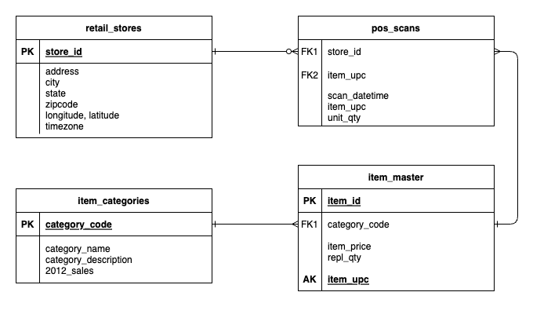

# mockaroo2kafka

Scripts that call the Mockaroo API, and then push results into a Kafka topic.

This simulates a retail point-of-sale (POS) scenario where barcode scans are happening at dozens of stores across the US. Multiple instances of the script can be run simultaneously to ramp up the data volume.



### Prerequisites

- Mockaroo account and schema to generate rows
- Kafka broker set up, and CLI installed and configured. The scripts currently assume Confluent

### Setup

In the `mockaroo` directory is a schema that you can import into mockaroo.

There are also three datasets that relate to the scan data that will be generated. You need to upload the `retail_stores` and `item_master` datasets to mockaroo also.

Pay careful attention to the lines in the script that call Mockaroo, and that call the Kafka CLI. Be sure they match your particular situation. You will also need to set, or pass in, the correct CLUSTER_ID and TOPIC for your setup.

| Directories / Files                      | Purpose                                                      |
| ---------------------------------------- | ------------------------------------------------------------ |
| `datasets/`                              | Data files related to the scans data to create an analysis scenario. Two of the tables are needed by mockaroo to reference valid foreign key values. There are also some example scan output files in there. |
| `gen_mocks_to_kafka.sh`                  | The main generator script.                                   |
| `gen_mocks_to_s3.sh`                     | An alternative script that uploads scan files to an S3 bucket instead of Kafka. |
| `mockaroo/`                              | The scenario to import into mockaroo                         |
| `start_threads.sh` and `stop_threads.sh` | Scripts to start/stop multiple instances of the generator script if you need to ramp up the data volume. |

### Running

You can either change the variable defaults in the scripts, or pass them in on the command line:

`$ CLUSTER_ID=<your_cluster_id> TOPIC=<kafka_topic> ./gen_mocks_to_kafka.sh`

Default values are:

```
DATA_DIR=/tmp/scans   # Two subdirectories and the status file will be created here
PREFIX=scan           # file name prefix
```

### Running Multiple Threads

If you need to generate a large volume of data without going over Mockaroo's 1000 row limit, you'll need to run several instances of the main script at once. Two scripts facilitate this:

`start_threads.sh` will kick off 5 threads by default. The variable defaults are:

```bash
DATA_DIR=/tmp/scans
THREADS=5
SCRIPT=./gen_mocks_to_kafka.sh
```

`stop_threads.sh` will write a 'STOP' message to the status file, causing all the generator scripts to stop.
