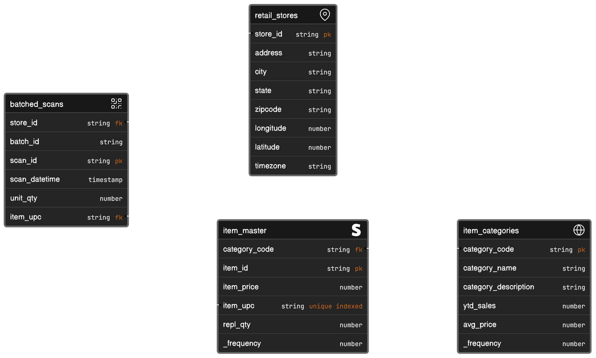

# mockaroo2kafka

Scripts that call the Mockaroo API, and then push results into a Kafka topic.

The demo simulates a retail point-of-sale (POS) scenario where barcode scans are happening at hundreds of stores across the US. Multiple instances of the script can be run simultaneously to ramp up the data volume. The tables are all related and taken together, and can be analyzed by product category or geography.



### Prerequisites

- Mockaroo account and schema to generate rows. Note that Mockaroo's free plan has a 200 call/day limit, and 1000 row/call limit. You can lift these limits with one of their paid plans.
- Kafka broker set up, and CLI installed and configured. The scripts currently assume Confluent.

### Setup

In the `mockaroo` directory is a schema that you can import into mockaroo. This schema will generate the `batched_scans` datasets.

There are also three static datasets that relate to the scan data. These can be combined with the scan data in queries.

You need to upload the `retail_stores` and `item_master` datasets to Mockaroo as they are also used to generate scans.

Pay careful attention to the lines in the `gen_mocks_to_kafka.sh` script that call Mockaroo, and that call the Kafka CLI. Be sure they match your particular situation. You will also need to set, or pass in, the correct CLUSTER_ID and TOPIC for your setup.

#### Directories

| Directories                 | Purpose                                                                                                                                                                                   |
| --------------------------- | ----------------------------------------------------------------------------------------------------------------------------------------------------------------------------------------- |
| `doc/`                      | Documentation files and images.                                                                                                                                                           |
| `scripts/`                  | Shell script files.                                                                                                                                                                       |
| `setup/`                    | Files to setup different components of the demo.                                                                                                                                          |
| `./confluent/`              | Has the value schema for the JSON files that will be flowing through the `batched_scans` topic.                                                                                           |
| `./mockaroo/`               | The schema to import into mockaroo to generate the batched_scans test data, and datasets that are required by it, and an example scan output files.                                       |
| `././datasets/`             | Data files related to the batched_scans data to create an analysis scenario. Two of the tables (retail_stores, item_master) are needed by mockaroo to reference valid foreign key values. |
| `./AWS-S3` and `./Postgres` | Optional data destination setup files, not currently used.                                                                                                                                |
| `utils/`                    | Utility scripts and programs.                                                                                                                                                             |

#### Scripts

| Script                                   | Purpose                                                                                                                                                                                                                                                                                                     |
| ---------------------------------------- | ----------------------------------------------------------------------------------------------------------------------------------------------------------------------------------------------------------------------------------------------------------------------------------------------------------- |
| `check_confluent_cli.sh`                 | Script to check that Confluent API is setup.                                                                                                                                                                                                                                                                |
| `consume_topic.sh`                       | Script to consume and print out the Kafka topic.                                                                                                                                                                                                                                                            |
| `gen_mocks_to_kafka.sh`                  | The main generator script.                                                                                                                                                                                                                                                                                  |
| `gen_mocks_to_s3.sh`                     | An alternative script that uploads scan files to an S3 bucket instead of Kafka.                                                                                                                                                                                                                             |
| `loop_static_to_kafka.sh`                | Alternative script to continuously send static data files to Kafka vs. calling Mockaroo each time. You can move produced files to the `static/` directory under `$DATA_DIR` and never hit Mockaroo's 200 call/day limit. Or send a combination of new/old records by running both this and `gen_mocks_...`. |
| `start_threads.sh` and `stop_threads.sh` | Scripts to start/stop multiple instances of the generator script if you need to ramp up the data volume.                                                                                                                                                                                                    |

### Running the data generator

You can either change the variable defaults in the scripts, or pass them in on the command line, i.e.:

`$ CLUSTER_ID=<your_cluster_id> TOPIC=<kafka_topic> ./gen_mocks_to_kafka.sh`

Default values are:

```
CLUSTER_ID            # You'll need to set this
TOPIC=batched_scans   # Currently, the Mockaroo example schema
DATA_DIR=/tmp/scans   # Subdirectories will be created here
PREFIX=$TOPIC         # file name prefix
SLEEP=300             # 5 minutes between batches
```

Note that you MUST change the call to Mockaroo to match the API call that Mockaroo generates for you.

### Running multiple threads

If you need to generate a larger volume of data without going over Mockaroo's 1000 row per call limit (on the free plan), you'll need to run several instances of the main script at once. Two scripts facilitate this:

`start_threads.sh` will kick off 5 threads by default. The variable defaults are:

```bash
DATA_DIR=/tmp/scans
THREADS=5
SCRIPT=./gen_mocks_to_kafka.sh
```

Running `stop_threads.sh` will write a 'STOP' message to the status file, causing all the generator scripts to stop.

### Looping over static data

If you can't, or don't want to call Mockaroo for each batch of data, you can take previously generated data files from `$DATA_DIR/processed` and move them to `$DATA_DIR/static` and then start up `loop_static_to_kafka.sh`.

Both this script, and `gen_mocks_to_kafka.sh` can be run at the same time.
